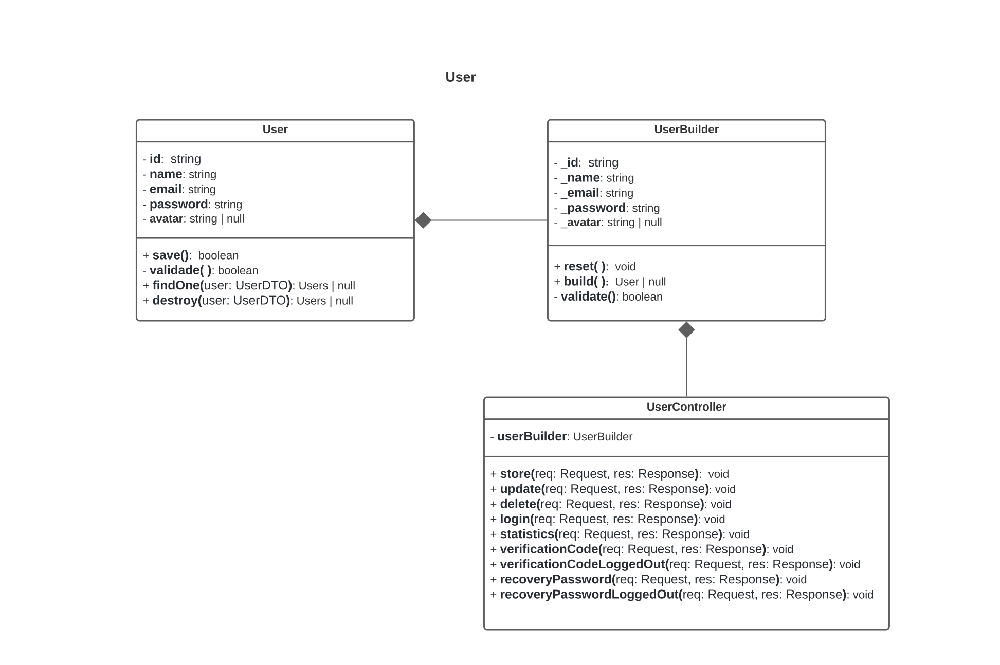
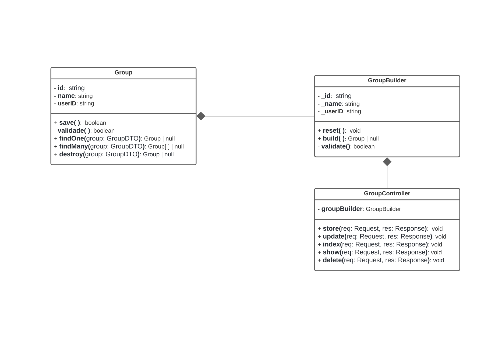
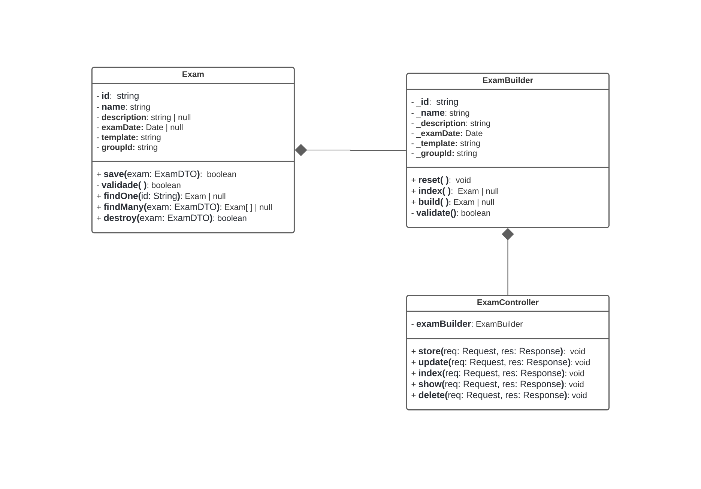
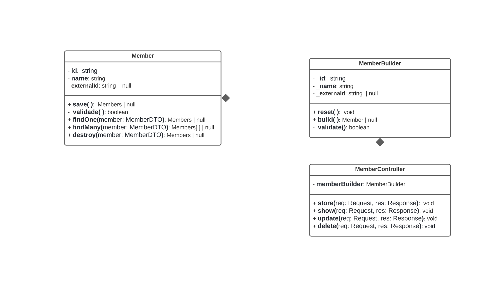
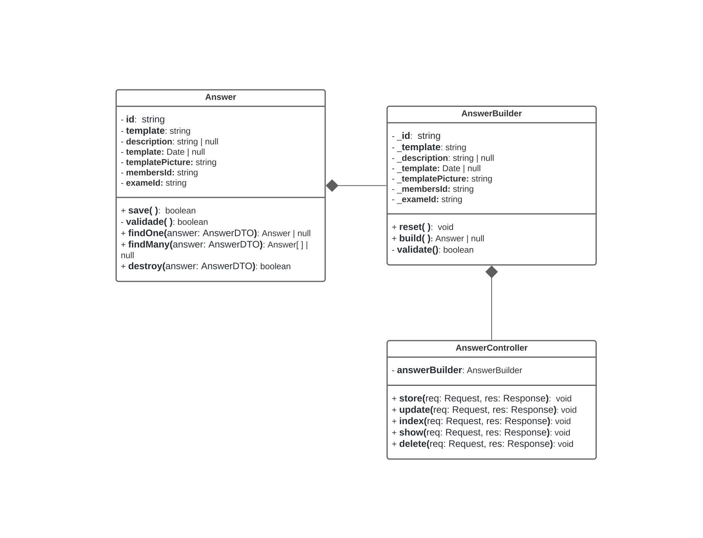

<h1 align="center"> Recognizer Backend </h1>


[](LICENSE.md)

---

<h2 id="about">💡&nbsp; Sobre o projeto</h2>

**Recognizer** é uma plataforma destinada a leitura e correção de gabaritos, proporcionando uma correção mais eficiente e precisa. Acesse agora a plataforma: [⤤ Ir para Recognizer](http://recognizer.vercel.app/).

Este repositório contém todo o código que compõe o back-end do projeto, os demais repositórios podem ser acessados em: [⤤ Recognizer Front-End](https://github.com/devArchetype/recognizer-frontend) e [⤤ Recognizer AI](https://github.com/devArchetype/recognizer-AI).

<h2 id="pattern">🕮&nbsp; Padrões utilizados </h2>

- Padrão DAO (Data Access Object)

Em resumo, DAO que provê uma interface que abstrai o acesso a dados;
lê e grava a partir da origem de dados (banco de dados, arquivo, memória, etc.); e
encapsula o acesso aos dados, de forma que as demais classes não precisam saber sobre isso.

- Padrão Builder

O padrão Builder faz parte dos padrões criacionais, onde o mesmo tem como fundamento a separação da construção de um objeto complexo da sua representação, de forma que o mesmo processo de construção possa criar diferentes representações, baseado em regras e parâmetros que sejam informados ao objeto responsável pela construção.

---

<h2 id="entities">👥&nbsp; Entidades </h2>


---

<h2 id="diagrams">📒&nbsp; Diagrama de Classes </h2>

- User


- Group


- Exams


- Member


- Answers


---

<h2 id="technologies">🛠&nbsp; Tecnologias</h2>

Este projeto foi desenvolvido usando as seguintes tecnologias:

✔️ [NodeJs](https://nodejs.org/en/)

✔️ [TypeScript](https://www.typescriptlang.org/)

✔️ [ExpressJS](https://expressjs.com/)

✔️ [Prisma](https://www.prisma.io/)

✔️ [MySQL](https://www.mysql.com/)

✔️ [Docker](https://www.docker.com/)

---

<h2 id="installation">🚀&nbsp; Como executar </h2>

```bash
# Clone o repositório
git clone https://github.com/devArchetype/recognizer-backend.git

# Entre na pasta da aplicação
cd recognizer-backend

# Instale as dependẽncias do projeto
npm i

# Suba o container do banco de dados
docker compose up -d

# Aplique as Migrações do BD
npx prisma migrate deploy

# Faça o build do projeto
npm run build

# Inicie o servidor
npm run start

# Acesse o servidor pelas rotas a partir de http://localhost:3000
```

---

<h2 id="developers">👨‍💻&nbsp;Desenvolvedores</h2>

- [Riquelme Damião](https://github.com/the-riquelme)
- [Paloma Bárbara](https://github.com/palomabarbara)
- [Marcus Vinícius](https://github.com/pymarcus)
- [João Gabriel](https://github.com/Gabrieljr42)
- [Isaac Santiago](https://github.com/eoisaac)
